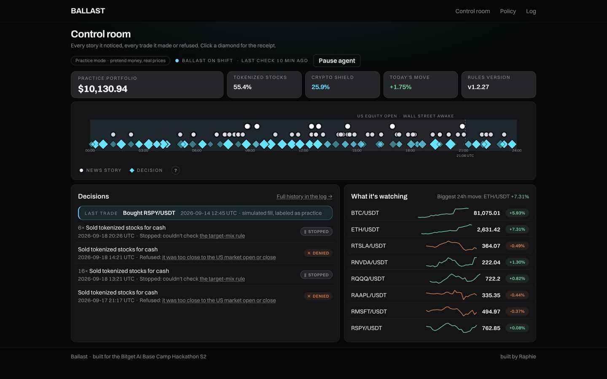
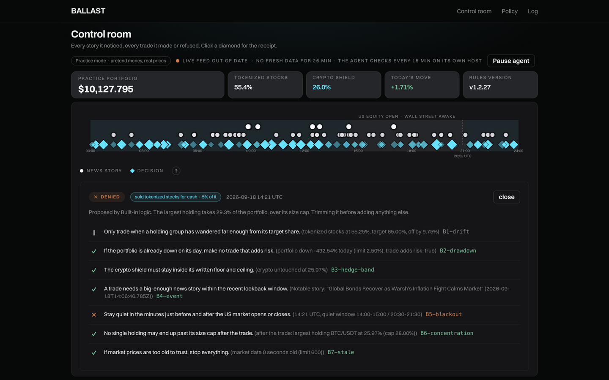

# Ballast

An autonomous agent that hedges tokenized US stocks into crypto on overnight macro shocks, gated by a written rulebook, with a receipt for every decision.

[Live Control Room](https://try-ballast.netlify.app/control-room) · [Demo Video](./demo/ballast-desktop-demo-final.mp4) · [Rules](https://try-ballast.netlify.app/policy) · [Execution Log](https://try-ballast.netlify.app/log)



[](https://try-ballast.netlify.app)
[](https://try-ballast.netlify.app)
[](#run-locally)
[](https://try-ballast.netlify.app/log)
[](./LICENSE)

---

## What is Ballast

Tokenized US stocks (Bitget rTokens: RNVDA, RTSLA, RAAPL, RMSFT, RSPY, RQQQ) trade 24/7, but the macro news that prices them breaks on US market hours. When a shock lands at 2:00 a.m., a tokenized-stock book just sits there and takes it.

Ballast is the overnight shift: every 15 minutes it reads macro headlines and live prices, proposes a rebalance toward a written target mix, and checks the proposal against seven deterministic rules. Allowed trades execute as clearly-labeled simulated fills; refused and stopped trades are recorded with the exact rule that stopped them. No prompt can weaken a rule: the gate is fixed code, not a model.

**Stats as of Sep 18, 2026:** 6,538 ledger events since Sep 9 · 31 simulated trades executed · 150+ proposals refused or stopped by the rulebook · 0 rule violations · rulebook at v1.2.27, editable live from the website.

---

## Video Walkthrough

The 2:36 showcase records the real control room running live (1080p desktop capture):

| Timestamp | Scene | What you see |
| :--- | :--- | :--- |
| **0:00** | The hook | 2:47 a.m. New York: the market is closed, and the agent just made a trade |
| **0:16** | The overnight problem | Tokenized stocks trade 24/7; a 3 a.m. rate shock moves them before any human wakes |
| **0:34** | The control room | The band: shaded hours, headline dots, decision diamonds, and the live paper-book strip |
| **0:59** | A decision receipt | Seven rules checked in order, each with its measured number; the order with its counterfactual book |
| **1:30** | Sense, Propose, Gate | The brain proposes, the rules dispose |
| **1:45** | Edit a rule on the site | Save commits to the agent's repo; the next receipt cites the new version |
| **2:05** | The append-only ledger | Simulated fills, labeled as such on every surface, running on Bitget's Agent Hub |
| **2:23** | The close | Seven rules, zero violations, everything live on screen |

Timestamps measured from the final cut (scene durations via ffprobe), not estimated from a storyboard.

---

## The Decision Receipt

Every decision ships a receipt, and every line of it is measurable on the live site:



| Item | What it shows | Where to verify |
| :--- | :--- | :--- |
| **Verdict** | ALLOWED / DENIED / STOPPED pill | [Control room](https://try-ballast.netlify.app/control-room), click any diamond |
| **The action** | Plain sentence: "sold tokenized stocks for cash" | Same receipt panel |
| **Each rule checked** | Rule sentence + the measured number that passed or failed it | Same; rule code links to [the rulebook](https://try-ballast.netlify.app/policy) |
| **The rule code** | B1..B7 in a muted subline, linking to the exact written rule | `/policy#B6-concentration` style anchors |
| **The order** | Simulated fill, labeled as practice, matched against real prices | [Execution log](https://try-ballast.netlify.app/log) |

---

## Honesty Boundary

| Layer | Implementation State | Verification |
| :--- | :--- | :--- |
| **Market data** | Live Bitget public REST tickers (rTokens + BTC/ETH), keyless, every 15 min | [Log](https://try-ballast.netlify.app/log), "Prices" filter |
| **Macro intelligence** | Live financial RSS with a labeled keyword severity classifier | [Log](https://try-ballast.netlify.app/log), "News" filter |
| **Policy engine** | 100% deterministic code; 24 tests green (`bunx vitest run`) | `agent/policy.ts`, `agent/policy.test.ts` |
| **Rule editing** | Live write-through: changes on the website commit to this repo; the agent pulls them before its next check | Commit history: "rule edit from try-ballast.netlify.app" |
| **Execution** | Paper trading: simulated fills against real prices, labeled as practice on every surface | Order lines in the log |
| **Custody** | None. No keys, no withdrawals, no mainnet risk | There is no key material in this repo |
| **LLM slot** | Wired behind one env var (`LLM_PROVIDER`); the deterministic fallback runs today | `agent/propose.ts` |

---

## Architecture: Sense, Propose, Gate, Record

```
  ┌─────────────────────────────────────────────────────────┐
  │                   1. SENSE LAYER                        │
  │  Bitget public REST tickers (6 rTokens + BTC/ETH)       │
  │  Macro RSS headlines, keyword severity classifier       │
  └────────────────────────────┬────────────────────────────┘
                               ▼
  ┌─────────────────────────────────────────────────────────┐
  │                  2. PROPOSE LAYER                       │
  │  Threshold fallback (runs today): trims oversized       │
  │  holdings, builds toward the target mix                 │
  │  LLM slot (Qwen via Agent Hub): wired behind LLM_PROVIDER│
  └────────────────────────────┬────────────────────────────┘
                               ▼
  ┌─────────────────────────────────────────────────────────┐
  │            3. DETERMINISTIC GATE LAYER                  │
  │  [x] B1  target-mix drift      > 10 points              │
  │  [x] B2  bad-day limit         down > 2.5% blocks risk  │
  │  [x] B3  crypto-band           21%-30% of portfolio     │
  │  [x] B4  news rule             big-enough story < 12h   │
  │  [x] B5  quiet hours           30 min around US open/close│
  │  [x] B6  size cap              one holding <= 28%       │
  │  [x] B7  old-data stop         prices <= 600s old       │
  └────────────────────────────┬────────────────────────────┘
                 allow ▼───── any fail/no-measure ▼
          simulated fill        refused/stopped, reason recorded
                               ▼
  ┌─────────────────────────────────────────────────────────┐
  │                  4. RECORD LAYER                        │
  │  Append-only JSONL ledger (ledger/events.jsonl)         │
  │  Live audit surfaces: control room, log, receipts       │
  └─────────────────────────────────────────────────────────┘
```

Rule numbers shown are the live values at v1.2.27; every one is editable on the [rules page](https://try-ballast.netlify.app/policy) and committed back to this repo. The formal twin of the rulebook lives in [policy/POLICY.md](./policy/POLICY.md) and `policy/policy.json`.

---

## Project Structure

```
ballast/
├── agent/                  # Core autonomous agent
│   ├── run.ts              # Tick orchestration: lock, sense, propose, gate, execute
│   ├── policy.ts           # The 7 deterministic rule measures
│   ├── policy-config.ts    # Rulebook read/validate/commit (write-through)
│   ├── propose.ts          # Threshold proposer + wired LLM slot
│   ├── executor.ts         # Paper executor: simulated, labeled fills
│   ├── sensor.ts           # Bitget public REST market ingest
│   ├── macro.ts            # RSS ingest + keyword severity classifier
│   └── ledger.ts / book.ts / agent-state.ts
├── app/                    # Next.js App Router frontend
│   ├── page.tsx            # Landing + live night watch band
│   ├── control-room/       # One-viewport cockpit: tiles, band, decisions, watchlist
│   ├── policy/             # Live rulebook editor (write-through to this repo)
│   ├── log/                # Full execution log with filters
│   └── components/         # kit.tsx primitives, watch floor, status controls
├── lib/                    # ledger reader + plain-language display mapping
├── demo/                   # Demo video assets and the master cut (1080p, 2:36)
├── ledger/                 # Append-only audit log (events.jsonl + night-one archive)
└── policy/                 # POLICY.md (human-readable) + policy.json (machine twin)
```

---

## Run Locally

```bash
# 1. Clone
git clone https://github.com/A-Raphie/ballast.git
cd ballast

# 2. Install (bun recommended; npm is not supported on some setups)
bun install

# 3. Run the test suite
bunx vitest run

# 4. Execute one agent tick (paper mode, writes to ledger/)
bun agent/run.ts

# 5. Start the web control room
bun run dev
```

The local server runs at `http://localhost:3000`. Without Bitget credentials the agent runs in paper mode against public endpoints, exactly as the live site does.

---

## The core loop, in five lines

```ts
// agent/run.ts, every 15 minutes
const proposal = await propose(book, macroEvents, pxOf, now);
const verdict = evaluate(proposal, policy);              // 7 deterministic rules
if (verdict.result === "allow") await execute(proposal); // simulated, labeled
ledger.append([proposal, verdict, order]);               // the receipt, whatever happened
```

## Deployment

Live site: **[try-ballast.netlify.app](https://try-ballast.netlify.app)** on Netlify. The agent ticks every 15 minutes on a private runner and commits its ledger to this repo. Rule edits made on the website commit through the GitHub Contents API, and the runner pulls them before its next check.

## License

MIT License. See [LICENSE](./LICENSE) for details.
